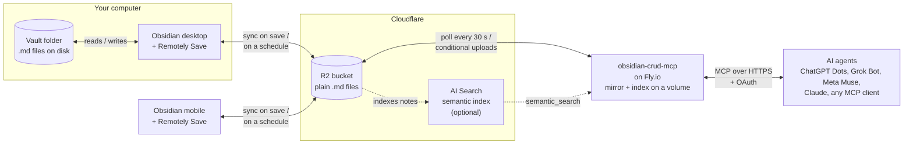

# Obsidian CRUD MCP

<!-- mcp-name: io.github.cdalton713/obsidian-crud-mcp -->


Give any AI agent access to your Obsidian vault over MCP. Run it locally against your vault files, or pair it with [Remotely Save](https://github.com/remotely-save/remotely-save) and an S3 bucket and deploy it to the cloud so it works even when your machine is off.

> **Example:** From your phone, ask your AI: "What's in my daily note for today?" — and get the full content back, with a link to open it in Obsidian.

---

## Long-term memory for always-on agents

Always-on personal agents such as [ChatGPT Dots](https://openai.com/), [Grok Bot](https://x.ai/) and [Meta Muse](https://www.meta.ai/) run on their own cloud computers, around the clock. Their built-in memory is locked to one vendor, and you can't easily read or correct it. Connect this server as a custom MCP connector and your Obsidian vault becomes the agent's memory instead:

- **Readable and editable.** Every memory is a Markdown note you can open, fix or delete in Obsidian.
- **Shared across agents.** ChatGPT, Grok, Muse, Claude and any other MCP client read and write the same vault.
- **Always reachable.** The cloud setup keeps answering when your laptop is off, the same hours your agent works.
- **Searchable.** `search_notes` finds exact phrases; `semantic_search` finds notes by meaning, so an agent can recall what it wrote last month without knowing the file name.

Use `WRITE_FOLDERS` (for example `WRITE_FOLDERS=Agents`) to keep agents' writes in one folder while they read the whole vault, and `MCP_INSTRUCTIONS` to tell every agent where and how to file what it learns.

---

## How it works

The server connects to your vault in two ways:

- **Filesystem mode** — reads `.md` files directly from your vault folder.
- **S3 mode** — your devices sync the vault to an S3-compatible bucket (Cloudflare R2, AWS S3, Backblaze B2, MinIO, ...) with the [Remotely Save](https://github.com/remotely-save/remotely-save) community plugin. The server keeps a local mirror of every note in the bucket, polls for changes every 30 seconds, and uploads its own writes to the bucket so your devices pick them up on their next sync.

Both modes expose the same MCP tools over HTTP, so any MCP-compatible agent can connect: Claude, ChatGPT, Grok, Meta Muse, Copilot, custom agents, anything that speaks the [Model Context Protocol](https://modelcontextprotocol.io).



---

## Choose your setup

| Need it always available? | Go to                                                                        |
| ------------------------- | ---------------------------------------------------------------------------- |
| Yes                       | [Setup A](#a-deploy-to-the-cloud-cloudflare--flyio) — Cloudflare R2 + Fly.io |
| No                        | [Setup B](#b-run-on-your-machine) — filesystem mode, pnpm dlx or Docker      |

---

## A. Deploy to the cloud (Cloudflare + Fly.io)

The whole setup takes about 30 minutes, plus the first vault upload and semantic index.

### What you need

| Requirement                                                                     | Used for                                | Cost                                     |
| ------------------------------------------------------------------------------- | --------------------------------------- | ---------------------------------------- |
| [Cloudflare account](https://dash.cloudflare.com/sign-up) with R2 enabled       | The bucket your vault syncs to          | Free up to 10 GB (R2 asks for a card)    |
| Cloudflare AI Search (optional)                                                 | The `semantic_search` tool              | Free tier, then about $1 per 9,000 notes |
| [Fly.io account](https://fly.io/app/sign-up) with a card on file                | Runs the MCP server                     | About $0–2/month                         |
| [flyctl](https://fly.io/docs/flyctl/install/)                                   | Deploys from your terminal              | Free                                     |
| [Remotely Save](https://github.com/remotely-save/remotely-save) on every device | Syncs Obsidian to the bucket            | Free                                     |
| bash, `git`, `openssl`                                                          | The setup script (macOS, Linux, or WSL) | Free                                     |

Install flyctl and log in:

```bash
curl -L https://fly.io/install.sh | sh
export PATH="$HOME/.fly/bin:$PATH"  # add to ~/.zshrc or ~/.bashrc
fly auth login
```

### 1. Cloudflare: create the R2 bucket and keys

1. In the [Cloudflare dashboard](https://dash.cloudflare.com/), open **R2 Object Storage** → **Create bucket**. Name it, e.g. `obsidian-vault`.
2. Copy your **Account ID** from the R2 overview page. Your S3 endpoint is `https://<account-id>.r2.cloudflarestorage.com`.
3. **R2** → **Manage API tokens** → **Create API token**. Permission **Object Read & Write**, limited to that bucket.
4. Save the **Access Key ID** and **Secret Access Key**. Cloudflare shows the secret once.

Any other S3-compatible store (AWS S3, Backblaze B2, MinIO) works for this step, but semantic search needs R2.

### 2. Obsidian: configure Remotely Save

Install [Remotely Save](https://github.com/remotely-save/remotely-save) on each device and open its settings:

| Setting             | Value                                                    |
| ------------------- | -------------------------------------------------------- |
| Remote service      | S3 or compatible                                         |
| Endpoint            | `https://<account-id>.r2.cloudflarestorage.com`          |
| Region              | `auto` (R2), or your bucket's region                     |
| Access Key ID       | from step 1                                              |
| Secret Access Key   | from step 1                                              |
| Bucket name         | `obsidian-vault`                                         |
| S3 URL style        | Path-style                                               |
| Encryption password | **leave empty** — the server cannot read encrypted notes |
| Remote prefix       | empty (or set `S3_PREFIX` on the server to match)        |

Click **Check connectivity**, enable sync on save and a schedule (e.g. every 5 minutes), then run the first sync from the device with the most complete copy of the vault. Wait for it to finish before step 3: AI Search indexes what is in the bucket.

### 3. Cloudflare: set up AI Search (optional, for `semantic_search`)

Skip this step to deploy without semantic search; you can add it later.

1. **AI** → **AI Search** → **Create** → choose **R2** as the source and pick your bucket.
2. Let the dashboard create the **service API token** it offers. AI Search uses that token to read the bucket. If you later roll it, indexing stops until you select the new token in the instance settings.
3. Under indexing, include `**/*.md` and exclude `.obsidian/**` and `_debug_remotely_save/**`. Turn on **hybrid search**.
4. Name the instance (e.g. `obsidian-vault`) and create it. Set the sync interval as low as it goes (15 minutes); the default is 6 hours.
5. **My Profile** → **API Tokens** → **Create Token** → **Custom token**. Add **Account** → **AI Search** → **Edit**, and **Account** → **AI Search** → **Run**, for your account. This is the server's token (`CF_AI_SEARCH_TOKEN`), separate from the service token in step 2.
6. Check the token: `curl -s https://api.cloudflare.com/client/v4/user/tokens/verify -H "Authorization: Bearer <token>"` returns `"status": "active"`.

The first index of a large vault takes a while (roughly 15 notes a minute). Track it with `pnpm dlx wrangler ai-search stats <instance>`.

From the command line instead of steps 1–4 (run `pnpm dlx wrangler login` first; the dashboard is still needed for the sync interval):

```bash
pnpm dlx wrangler ai-search create obsidian-vault --type r2 --source obsidian-vault \
  --include-items '**/*.md' --exclude-items '.obsidian/**' '_debug_remotely_save/**' --hybrid-search
```

### 4. Fly.io: deploy the MCP server

```bash
git clone https://github.com/cdalton713/obsidian-crud-mcp.git
cd obsidian-crud-mcp
./deploy/setup.sh
```

The script asks for:

- the vault name (as shown in Obsidian, used for deep links)
- the S3 endpoint, region, bucket, prefix and key pair from step 1
- the Cloudflare account ID, AI Search instance name and server token from step 3 (leave blank to skip semantic search)

It then creates the app, a shared IPv4 and an IPv6 address, a 1 GB volume for the mirror, sets every value as a Fly secret, builds the image from this checkout on Fly's builders, and deploys one machine. It prints the MCP endpoint and password at the end. **Save the password**; it is not shown again.

Check the deployment:

```bash
curl https://<app>.fly.dev/health   # returns 200 once the server is up
fly logs -a <app>                   # watch the first bucket sync
```

### 5. Connect your agent

- **Claude** (web, desktop, mobile): **Settings** → **Connectors** → **Add custom connector**, URL `https://<app>.fly.dev/mcp`. A password page opens; enter the MCP password.
- **ChatGPT (including Dots), Grok (including Grok Bot), Meta Muse:** add a custom MCP connector in the app's connector settings with the same URL, then enter the MCP password on the page that opens.
- **Other clients:** use the same URL with Streamable HTTP. Clients without OAuth can send `Authorization: Bearer <MCP password>`.

### Other ways to host it

**Docker Compose on any always-on server:**

```bash
git clone https://github.com/cdalton713/obsidian-crud-mcp.git
cd obsidian-crud-mcp
cp .env.example .env   # fill in the S3 settings, VAULT_NAME, MCP_AUTH_TOKEN and the optional CF_* values
docker compose up -d
```

**Or run the Docker image directly:**

```bash
docker run -p 8787:8787 \
  -v mcp-data:/data -e DATA_DIR=/data -e VAULT_PATH=/data/vault \
  -e S3_ENDPOINT=https://<account-id>.r2.cloudflarestorage.com \
  -e S3_BUCKET=obsidian-vault -e S3_ACCESS_KEY_ID=... -e S3_SECRET_ACCESS_KEY=... \
  -e VAULT_NAME=MyVault -e MCP_AUTH_TOKEN=yourpassword \
  -e BASE_URL=https://your-server-url \
  ghcr.io/cdalton713/obsidian-crud-mcp:latest
```

Put either behind HTTPS and set `BASE_URL` to the public URL (OAuth callbacks need it). The endpoint is `https://your-server/mcp`. Add `CF_ACCOUNT_ID`, `CF_AI_SEARCH_TOKEN` and `CF_AI_SEARCH_INSTANCE` to enable semantic search.

### How changes flow

- **Device → agent:** a device edit reaches the bucket on its next Remotely Save sync, then the server within one poll (`S3_POLL_SECONDS`, default 30). The poll downloads the changed notes and updates the search index from them in the same pass.
- **Agent → device:** the server uploads to the bucket first, then updates its mirror. Devices see the change on their next sync.
- **Conflicts:** a write fails with "changed in the bucket" if a device uploaded a newer version since the last poll; read the note again and retry. Between a device and Remotely Save, Remotely Save's own conflict rules apply.
- **Only notes are mirrored.** Attachments, `.obsidian/` and Remotely Save's metadata files stay in the bucket and are never touched.
- **Writes never wait for a poll.** An upload runs alongside the bucket poll; a poll that started before the write leaves that note alone.

### Cost

| Component                          | Cost                                 |
| ---------------------------------- | ------------------------------------ |
| Cloudflare R2                      | Free up to 10 GB and 1M writes/month |
| Cloudflare AI Search (optional)    | Free tier; ~$1 to index 9,000 notes  |
| Fly.io MCP VM (shared, 512MB)      | ~$0-2/month (suspends when idle)     |
| 1GB persistent volume (the mirror) | ~$0.15/month                         |

As of March 2026, Fly.io [may waive charges under $5/month](https://community.fly.io/t/bill-clarification-under-5-usd-of-usage-bill-charges-are-waived/26366), which could make this effectively free with a shared IPv4. Either way, cheaper than Obsidian Sync ($4/month) and you own the data.

A suspended Fly machine does not poll the bucket. It catches up on the first poll after waking, so the first request after a long idle period can see notes up to one poll interval old.

---

## B. Run on your machine

Run the MCP server locally against your vault folder. Machine must stay on for agents to reach it.

Requires Node 22.19.0 or later. Enable pnpm once with `corepack enable`.

```bash
VAULT_PATH=~/Documents/MyVault \
VAULT_NAME=MyVault \
pnpm dlx obsidian-crud-mcp
```

**Or with Docker:**

```bash
docker run -p 8787:8787 \
  -v mcp-data:/data -e DATA_DIR=/data \
  -e VAULT_PATH=/vault -v ~/Documents/MyVault:/vault \
  -e VAULT_NAME=MyVault \
  ghcr.io/cdalton713/obsidian-crud-mcp:latest
```

Your MCP endpoint is `http://localhost:8787/mcp`. S3 mode also works locally: add the `S3_*` variables and point `VAULT_PATH` at an empty mirror folder (not your real vault).

**Want remote access?** Add a tunnel (machine must stay on):

```bash
cloudflared tunnel --url http://localhost:8787    # free
tailscale funnel 8787                             # or Tailscale
ngrok http 8787                                   # or ngrok
```

Set `BASE_URL` to the tunnel URL when using authentication.

---

## Tools

| Tool                     | Description                                                                                           |
| ------------------------ | ----------------------------------------------------------------------------------------------------- |
| `read_note`              | Read a note, heading section, or block by path                                                        |
| `read_notes`             | Read up to 20 notes with a total response size limit and a status for each path                       |
| `search_notes`           | Search note text for a literal phrase; return excerpts, line numbers, and continuation cursors        |
| `semantic_search`        | Find notes by meaning via Cloudflare AI Search (optional); ranked passages with paths and URLs        |
| `write_note`             | Create or overwrite a note (replaces entire content)                                                  |
| `edit_note`              | Append, prepend, or replace exact text in a whole note, heading section, or block                     |
| `update_note_properties` | Set or remove typed YAML properties while preserving the Markdown body                                |
| `get_note_outline`       | Get heading paths, section line ranges, and block IDs                                                 |
| `list_tasks`             | List standard Markdown checkbox tasks by folder, tag, and completion state                            |
| `list_folders`           | List all folders in the vault with note counts — use to discover folder names                         |
| `list_tags`              | List all tags in the vault with counts — use to discover tags before filtering                        |
| `list_notes`             | List notes with timestamps. Filter by folder, name, tag, or date. Sort by name or modified.           |
| `delete_note`            | Delete a note                                                                                         |
| `move_note`              | Move or rename a note — works across folders, creates destination folders automatically               |
| `get_note_metadata`      | Get frontmatter, tags, outgoing links, backlinks, size, and timestamps — navigate the knowledge graph |

Every tool response includes an [Obsidian deep link](https://help.obsidian.md/Extending+Obsidian/Obsidian+URI) (`obsidian://open?vault=...&file=...`) that works on Mac and iOS.

> "Add a bullet point to my daily note." "Find my notes about the MCP server and fix the typo in the second one."

### Content search and batch reads

`search_notes` accepts a single-line `query`, optional `folder` and `tag`, and
`case_sensitive` (default `false`). The query is a literal phrase, not a regular
expression or Obsidian search expression. Results contain one excerpt per matching
line, a 1-based `line`, the note `path`, and an Obsidian `url`. Frontmatter lines
are searched too. The `tag` filter (also on `list_notes` and `list_tasks`) matches
tags exactly: `project` does not match `project/sub`.

Search and task listing scan note content held in memory: the server keeps up to
`SEARCH_CONTENT_CACHE_MB` of notes cached (default 32, about 30,000 typical notes)
and refills the cache from disk after a restart, so a vault of typical size is
covered in one call without touching the disk. Notes beyond the cap are read from
disk 16 at a time. Scans run in path order. Each call reads at most
`max_notes` notes (default 10,000, maximum 100,000) and returns at most `limit`
results (default 20, maximum 50). Follow `next_cursor` with the same filters until
it is `null`, even when a page has no results. Notes over 1,000,000 characters and
read or parse failures appear in `skipped_notes`. A page also stops before a note
would take it past 50,000,000 characters; every page processes at least one note.
Results are live, not a snapshot: edits between calls can change subsequent pages.

Once the metadata index is ready (seconds after startup), the `folder` and `tag`
filters are answered from it, so a tag search reads only the tagged notes. Until
then the folder is listed and the tag is checked in each note as it is read.

### Semantic search (optional, S3 mode)

`semantic_search` finds notes by meaning: a ranked hybrid (embedding + keyword)
search over the whole vault, returning the best-matching passages with path,
score and URL. It is backed by [Cloudflare AI Search](https://developers.cloudflare.com/ai-search/),
which indexes the same R2 bucket Remotely Save syncs to; the server only sends
queries, so it adds no memory or CPU to the machine. Set it up with
[step 3 of Setup A](#3-cloudflare-set-up-ai-search-optional-for-semantic_search).

AI Search re-indexes on its own schedule (every 6 hours by default, configurable
down to 15 minutes), and the server asks for a re-index about a minute after it
writes a note, so an agent's own edits show up within minutes. `search_notes`
always reads current content and remains the right tool for exact phrases. At
the time of writing, Cloudflare includes 5 million ingestion tokens and 1,000
semantic queries a month; a 9,000-note vault indexes for about a dollar.

`read_notes` accepts `paths` and `max_chars` (default 20,000; range 1,024–50,000).
The limit covers the complete serialized JSON response. Each entry reports
`ok`, `not_found`, `error`, or `truncated`. Truncated entries include
`omitted_chars`; paths not returned appear in `omitted_paths`. Paths that do not
exist are also listed in `missing_paths`. Use `read_note`
for the remaining content. If even the path list exceeds the budget, request
fewer paths or increase the budget. Filesystem read failures can appear as
`not_found` because the backend returns the same result for both cases.

### Properties, sections, and tasks

`update_note_properties` takes a `path`, a `set` object, and/or a `remove` array.
For example, `set: {"status":"done","tags":["project"],"reviewed":true}` sets
typed properties without replacing the note body. Values can be strings, numbers,
booleans, `null`, or lists of these types. Frontmatter is read and written with `@11ty/gray-matter`.
Updates serialize the YAML again, so comments, spacing, quoting, and list style
can change. The Markdown body stays byte-for-byte identical. Invalid YAML is
rejected, and unrelated property values are preserved.
Read-only mode and writable-folder restrictions also apply to this tool.

`get_note_outline` returns document-level headings and block IDs with 1-based,
inclusive line ranges. Heading ranges include child sections. Pass a returned
heading path, such as `heading: ["Project", "Notes"]`, or a block ID, such as
`block: "decision"`, to `read_note` or `edit_note`. Use only one selector.
The selected content excludes its own heading line or block marker. Edits preserve
those markers and text outside the selected range. Duplicate or missing targets
are rejected. Block IDs in paragraphs, list items, and blockquotes are supported,
as are standalone IDs following a block. Block IDs on heading lines are not listed.
Frontmatter and code examples are ignored. Appending or prepending to a heading
section adds a blank line when needed so the new text cannot become part of a
following setext heading. A block replace that would leave the block empty is
rejected.

`list_tasks` defaults to `status: "incomplete"`; use `"completed"` or `"all"`
to include checked tasks. It supports standard Markdown checkboxes, including
nested and ordered lists. Task text is limited to 500 characters and marked
`truncated` when shortened. Plugin-specific task statuses, due dates, and
recurrence are not interpreted.

---

## Authentication

Set `MCP_AUTH_TOKEN` to a password to enable authentication:

```bash
MCP_AUTH_TOKEN=mysecretpassword pnpm dlx obsidian-crud-mcp
```

The server includes a self-contained OAuth 2.1 provider. When an agent connects:

1. A browser window opens with a password page
2. Enter the `MCP_AUTH_TOKEN` password
3. The agent gets an access token and refreshes it transparently

The session is shared across all your Claude interfaces (Desktop, Web, Mobile) and persists across server restarts. You'll need to re-enter the password after 14 days of inactivity (configurable via `MCP_REFRESH_DAYS`).

For non-OAuth clients (curl, MCP Inspector, custom agents), you can also pass the token directly as `Authorization: Bearer <MCP_AUTH_TOKEN>`.

Without `MCP_AUTH_TOKEN`, the server runs without authentication — suitable for local use or behind a private network.

---

## Environment variables

| Variable                  | Required  | Default                 | Description                                                                                                                                                                                                                                                                                                                                                                                                                                                                                                                                                                   |
| ------------------------- | --------- | ----------------------- | ----------------------------------------------------------------------------------------------------------------------------------------------------------------------------------------------------------------------------------------------------------------------------------------------------------------------------------------------------------------------------------------------------------------------------------------------------------------------------------------------------------------------------------------------------------------------------- |
| `VAULT_PATH`              | Yes       | —                       | Path to your Obsidian vault directory (in S3 mode, the local mirror folder; created if missing)                                                                                                                                                                                                                                                                                                                                                                                                                                                                               |
| `S3_BUCKET`               | S3 mode   | —                       | Bucket Remotely Save syncs to. Setting it selects S3 mode (requires `VAULT_PATH`)                                                                                                                                                                                                                                                                                                                                                                                                                                                                                             |
| `S3_ENDPOINT`             | S3 mode   | —                       | S3 endpoint, e.g. `https://<account-id>.r2.cloudflarestorage.com`. Omit for AWS S3                                                                                                                                                                                                                                                                                                                                                                                                                                                                                            |
| `S3_ACCESS_KEY_ID`        | S3 mode   | —                       | Access key ID                                                                                                                                                                                                                                                                                                                                                                                                                                                                                                                                                                 |
| `S3_SECRET_ACCESS_KEY`    | S3 mode   | —                       | Secret access key                                                                                                                                                                                                                                                                                                                                                                                                                                                                                                                                                             |
| `S3_REGION`               | S3 mode   | `auto`                  | Region (`auto` for R2)                                                                                                                                                                                                                                                                                                                                                                                                                                                                                                                                                        |
| `S3_PREFIX`               | S3 mode   | —                       | Remote base directory, if Remotely Save uses one                                                                                                                                                                                                                                                                                                                                                                                                                                                                                                                              |
| `S3_POLL_SECONDS`         | S3 mode   | `30`                    | Seconds between bucket polls (minimum 5)                                                                                                                                                                                                                                                                                                                                                                                                                                                                                                                                      |
| `SEARCH_CONTENT_CACHE_MB` | Optional  | `32`                    | Note content kept in memory for `search_notes` and `list_tasks`, in millions of characters (about MB); `0` disables                                                                                                                                                                                                                                                                                                                                                                                                                                                           |
| `CF_ACCOUNT_ID`           | Semantic  | —                       | Cloudflare account ID; with the two settings below, enables the `semantic_search` tool                                                                                                                                                                                                                                                                                                                                                                                                                                                                                        |
| `CF_AI_SEARCH_TOKEN`      | Semantic  | —                       | Cloudflare API token with AI Search Edit and Run permissions                                                                                                                                                                                                                                                                                                                                                                                                                                                                                                                  |
| `CF_AI_SEARCH_INSTANCE`   | Semantic  | —                       | Name of the AI Search instance that indexes the bucket                                                                                                                                                                                                                                                                                                                                                                                                                                                                                                                        |
| `CF_AI_SEARCH_NAMESPACE`  | Semantic  | `default`               | Namespace the instance lives in                                                                                                                                                                                                                                                                                                                                                                                                                                                                                                                                               |
| `INDEX_PASSPHRASE`        | Optional  | —                       | Encrypts the persisted metadata index (note paths, tags, links) at rest with AES-256-GCM                                                                                                                                                                                                                                                                                                                                                                                                                                                                                      |
| `VAULT_NAME`              | All modes | `MyVault`               | Vault name (used for deep links and index storage)                                                                                                                                                                                                                                                                                                                                                                                                                                                                                                                            |
| `MCP_AUTH_TOKEN`          | Optional  | —                       | Password for authentication                                                                                                                                                                                                                                                                                                                                                                                                                                                                                                                                                   |
| `BASE_URL`                | Optional  | `http://localhost:PORT` | Public URL (for OAuth callbacks when using a tunnel)                                                                                                                                                                                                                                                                                                                                                                                                                                                                                                                          |
| `PORT`                    | Optional  | `8787`                  | HTTP port                                                                                                                                                                                                                                                                                                                                                                                                                                                                                                                                                                     |
| `HOST`                    | Optional  | `0.0.0.0`               | Bind address (`127.0.0.1` to restrict to localhost)                                                                                                                                                                                                                                                                                                                                                                                                                                                                                                                           |
| `MCP_ALLOWED_HOSTS`       | Optional  | —                       | Comma-separated extra `Host` values accepted in no-auth mode (e.g. `192.168.1.5,mybox.local`). No-auth mode rejects any other Host to block browser DNS-rebinding; localhost is always allowed. Ignored when `MCP_AUTH_TOKEN` is set.                                                                                                                                                                                                                                                                                                                                         |
| `DATA_DIR`                | Optional  | `~/.obsidian-mcp`       | Directory for persisted data (metadata index, auth tokens)                                                                                                                                                                                                                                                                                                                                                                                                                                                                                                                    |
| `LOG_LEVEL`               | Optional  | —                       | Set to `debug` for verbose logging (tool calls, index sync)                                                                                                                                                                                                                                                                                                                                                                                                                                                                                                                   |
| `MCP_REFRESH_DAYS`        | Optional  | `14`                    | Days before auth session expires                                                                                                                                                                                                                                                                                                                                                                                                                                                                                                                                              |
| `READ_ONLY`               | Optional  | `false`                 | Set to `true` to disable all write tools (`write_note`, `edit_note`, `delete_note`, `move_note`, `update_note_properties`). Only read tools are exposed via MCP, and the vault backend rejects writes as well. Useful when sharing the server with multiple AI clients and write access should be opt-in. This protects the vault from MCP clients; it is not a storage-level guarantee. To make the bucket itself refuse writes, give the server read-only S3 keys.                                                                                                          |
| `WRITE_FOLDERS`           | Optional  | —                       | Comma-separated list of vault-relative folders where writes are allowed (e.g. `MCP,Inbox`). When set, the whole vault stays readable but `write_note`, `edit_note`, `delete_note`, `move_note`, and `update_note_properties` refuse paths outside these folders (`move_note` requires both source and destination to be writable). Enforced server-side, unlike `MCP_INSTRUCTIONS`. Matching is case-sensitive and folder-boundary-aware (`MCP` matches `MCP/note.md` but not `MCP-private/note.md`). Ignored when `READ_ONLY=true`; unset means the whole vault is writable. |
| `MCP_INSTRUCTIONS`        | Optional  | —                       | Extra text appended to the server's MCP `instructions` (the string clients inject into the system prompt). Use this to bake vault-specific conventions into the server — e.g. folder structure, naming rules, folders to avoid — so they apply across every MCP client without per-client config. Best-effort: not all clients respect `instructions`.                                                                                                                                                                                                                        |
| `MCP_INSTRUCTIONS_FILE`   | Optional  | —                       | Path to a file (e.g. markdown) whose contents are appended to the MCP `instructions`. Easier than `MCP_INSTRUCTIONS` for multi-line conventions. If both are set, the file wins and `MCP_INSTRUCTIONS` is ignored (with a startup warning). Missing/unreadable file or files larger than 32 KB are fatal startup errors. **Store this file somewhere only the service user can write (e.g. `chmod 600`)** — its contents land in every MCP session's system prompt, so write access to it = prompt-injection access to every client.                                          |

Set `VAULT_PATH` for filesystem mode, or `S3_BUCKET` plus `VAULT_PATH` (the mirror folder) for S3 mode.

---

## Try without an agent

Test the server interactively using the [MCP Inspector](https://github.com/modelcontextprotocol/inspector):

```bash
VAULT_PATH=~/Documents/MyVault pnpm dlx obsidian-crud-mcp &
pnpm dlx @modelcontextprotocol/inspector
```

Set transport to **Streamable HTTP**, enter `http://localhost:8787/mcp`, and connect.

---

## How to update

| How you run it               | How to update                                                                                                                                                                                                           |
| ---------------------------- | ----------------------------------------------------------------------------------------------------------------------------------------------------------------------------------------------------------------------- |
| `pnpm dlx obsidian-crud-mcp` | Run `pnpm dlx obsidian-crud-mcp@latest`                                                                                                                                                                                 |
| Fly.io                       | `git pull`, then from the repo root: `fly deploy . --config deploy/mcp-only/fly.toml --dockerfile Dockerfile`. If you lost the fly.toml, run `fly config save --app your-app-name` in `deploy/mcp-only/` to restore it. |
| Docker                       | `docker pull ghcr.io/cdalton713/obsidian-crud-mcp:latest` and restart                                                                                                                                                   |

---

## Known limitations

- **Single vault per instance.** Each server connects to one vault. For multiple vaults, run multiple instances on different ports.
- **Single machine on Fly.io.** Auth state is in-memory, so multiple machines break the OAuth flow. The setup script enforces this automatically.
- **No merge on conflict.** In S3 mode an agent write is refused when a device uploaded a newer version since the last poll. In filesystem mode, last write wins.
- **Not real-time.** In S3 mode, changes travel through the bucket: devices see agent edits on their next Remotely Save sync, and the server sees device edits within one poll.
- **No end-to-end encryption.** Remotely Save's encryption password must stay empty for the server to read the bucket.
- **Text only.** Binary attachments are not exposed through MCP tools.
- **Deep links depend on the client.** Obsidian `obsidian://` deep links are included in every tool response. They work on Claude Mobile and in browsers, but some clients (Claude Desktop) may not render them as clickable links.
- **Node 22+ required.**
- **Setup script requires bash.** The `deploy/setup.sh` script works on macOS and Linux. On Windows, use WSL or Git Bash.

---

## Safety

This server gives an AI agent read/write access to your Obsidian vault.

**Agents can modify and delete notes.** Keep backups. Use tool approval deliberately.

**Authentication is optional.** Always set `MCP_AUTH_TOKEN` when exposing to the internet.

**Use HTTPS in production.** Use a tunnel or deploy behind a reverse proxy.

**Don't leave `LOG_LEVEL=debug` on in production.** Debug logging records every tool call's arguments, including note contents, and full error stacks. Credentials embedded in URLs are redacted from logs at every level.

This software is provided as-is under the [MIT license](https://github.com/cdalton713/obsidian-crud-mcp/blob/main/LICENSE). You are responsible for what agents do with your vault.

---

## Development

```bash
git clone https://github.com/cdalton713/obsidian-crud-mcp.git
cd obsidian-crud-mcp
corepack enable
pnpm install && pnpm run build
pnpm test          # unit tests
pnpm run test:e2e  # integration tests
pnpm run typecheck # strict TypeScript checks
```

S3 mode is unit-tested against an in-memory bucket (`aws-sdk-client-mock`), so the
tests need no cloud credentials.

---

## License

MIT — see [LICENSE](https://github.com/cdalton713/obsidian-crud-mcp/blob/main/LICENSE).

## Acknowledgements

- [Remotely Save](https://github.com/remotely-save/remotely-save) — the Obsidian plugin that syncs the vault to S3
- [FastMCP](https://github.com/punkpeye/fastmcp) — TypeScript MCP framework
- [Fly.io](https://fly.io/) — deployment platform
